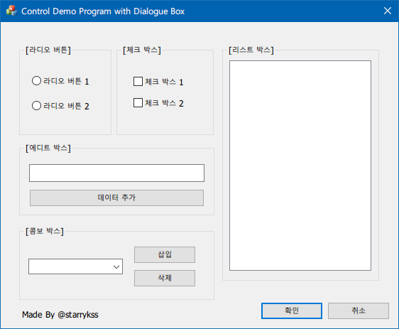

# Basic Control Demo Program with MFC Programming
[2020-09-29 ~ 2020-10-10] Basic Control Demo Program with MFC Programming (C++)

### 프로그램 개발 환경
- Language : C++
- OS : Microsoft Windows 10
- IDE : Microsoft Visual Studio 2019 16.4

### 기능 설명
- Basic Control의 기본적인 사용법을 익힐 수 있음.

### 실행 화면

